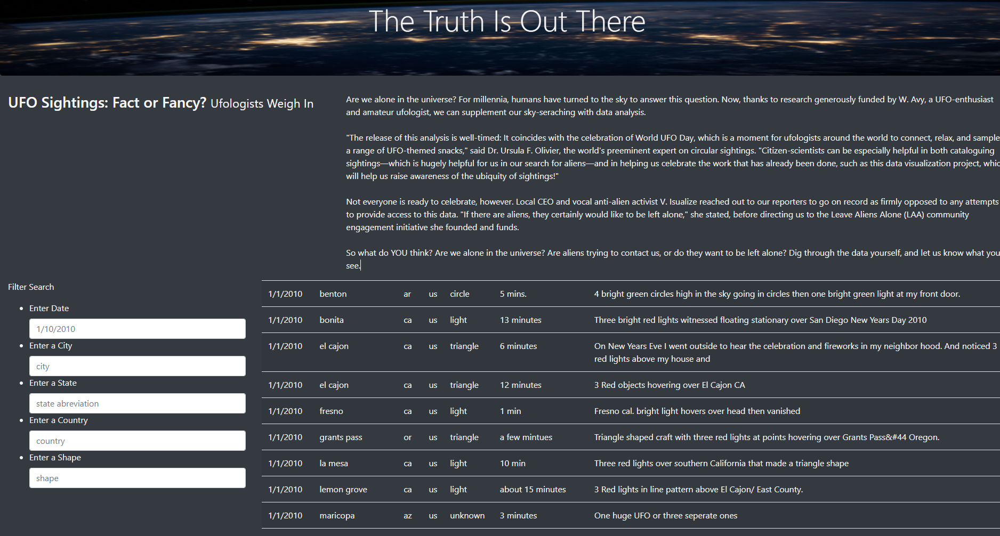
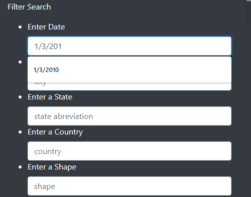
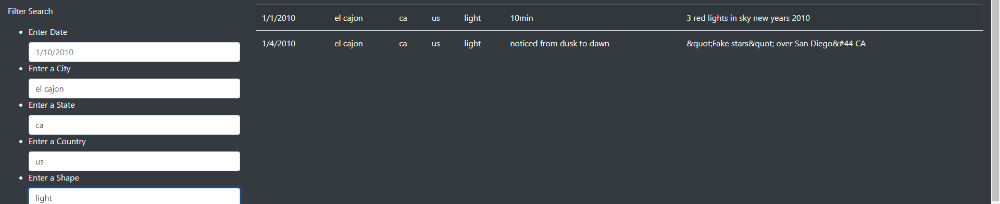
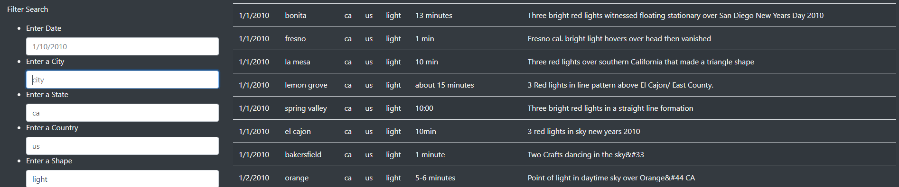

# UFOs
## Overview
The purpose of this project is to design a functional, graphical interface that filters and displays UFO sighting data. This .js application filters UFO sighting data by any combination of Date, City, State, Country and Shape of UFO. Our table on the webpage displays the six filtration columns as well as the duration and a description of the sighting. The search criteria entered is filtered upon pressing the enter key, utilizing d3 for event listening. Our .html script creates, colors and specifies various classes such as jumbotrons, navbars, tables, rows & columns, etc. Further styling and an image are added in the .css script. The purpose
## Results
Upon launching the .html, the graphical interface is loaded into a webpage hosted by the machine's local drive. The full UFO data can be read in the table. Shown in figure 1 below.

A filter search field can selected by clicking and an exact value can be keyed in and filtered by upon pressing the 'Enter' key. Shown in figure 2 below.

The search result can complete with entries in any combination of the filter search fields. Shown in figure 3 below.

To remove or edit a filter search by one of the fields, the value in that field can be deleted or changed followed by an 'Enter' key press. To remove all filter search field criteria, each filter search can be deleted follow by an 'Enter' key press, or the web page can be refreshed. Shown in figure 4 below.

## Summary
One drawback of this data is that the search result only locates exact matches to the filter search entries. One addition for further development is to associate alternative filter search criteria formats with their matches in the UFO data, such as "CA" equals "ca" for the State filter search. Additionally, search criteria formats for duration could be associated with the different formats in the UFO data, and a Duration filter search tab could be added to the .html and .js application.
